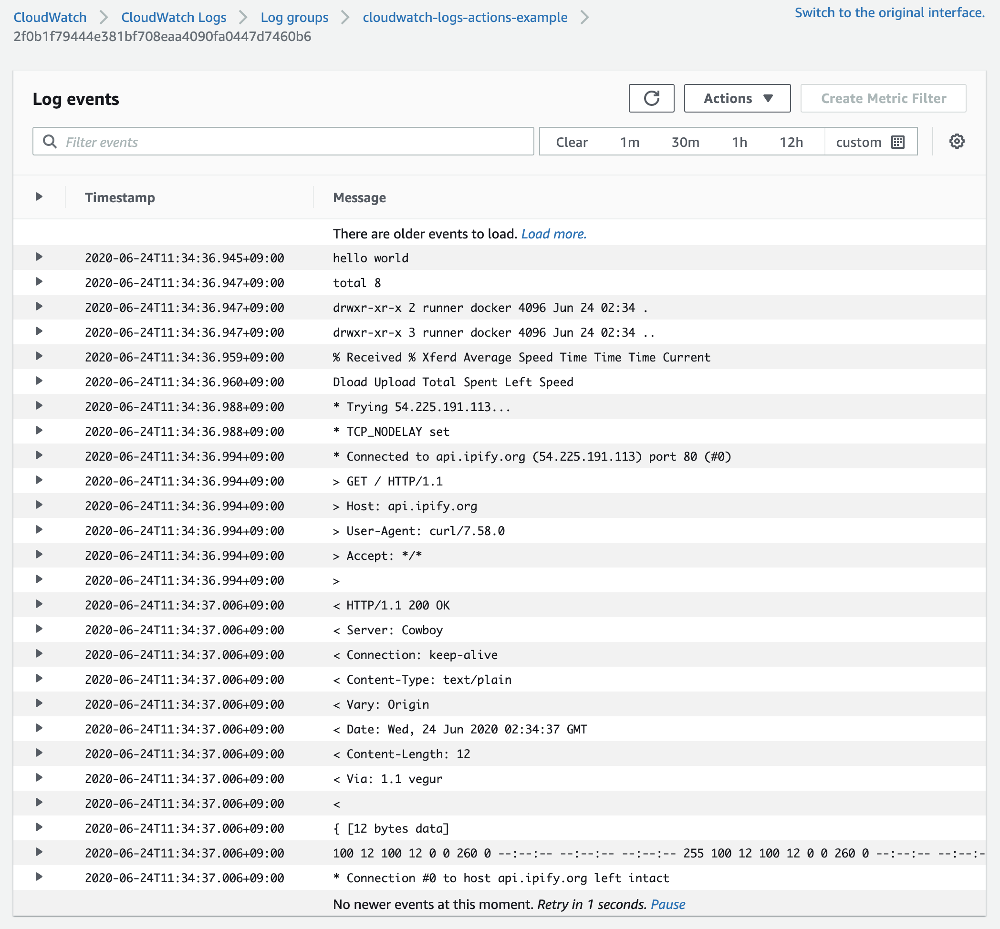

# cloudwatch-logs-actions

[](https://github.com/mooyoul/cloudwatch-logs-actions/actions)
[](https://github.com/mooyoul/cloudwatch-logs-actions/actions)
[](https://github.com/semantic-release/semantic-release)
[](https://renovatebot.com/)
[](http://mooyoul.mit-license.org/)

GitHub action that integrates with Amazon CloudWatch Logs.



-----

## Why?

I have an open sourced Backend Project, and I want to hide
deploy log to prevent sensitive information leak.

... but currently, There are no way to hide logs of Github Actions.
So, My idea is - forward stdout/stderr output to CloudWatch Logs without printing logs.

See below example for further details.


##### Example

```yaml
# ...
jobs:
  job:
    runs-on: ubuntu-latest
    timeout-minutes: 5
    steps:
      - name: Deploy
        uses: mooyoul/cloudwatch-logs-actions@v1.1.1
        env:
          AWS_DEFAULT_REGION: us-east-1
          AWS_REGION: us-east-1
          AWS_ACCESS_KEY_ID: ${{ secrets.AWS_ACCESS_KEY_ID }}
          AWS_SECRET_ACCESS_KEY: ${{ secrets.AWS_SECRET_ACCESS_KEY }}
        with:
          group: my-open-project
          stream: ${{ gihub.sha }}
          retention: 14
          run: |
            # you can use multiline commands if needed
            npm run deploy:stage
            npm run deploy:prod
```

##### Input

```typescript
type Input = {
  // Cloudwatch Logs Region
  region: string;

  // Name of Log Group
  group: string;

  // Name of Log Stream
  stream: string;

  // The number of days to retain the log events in the specified log group.
  // Possible values are: 1, 3, 5, 7, 14, 30, 60, 90, 120, 150, 180, 365, 400, 545, 731, 1827, and 3653.
  retention?: string;
  
  // Which shell to use
  // Possible values are: sh, bash (default: sh)
  shell?: string;

  // Command to run, Supports multiple commands
  run: string;
}
```

##### Output

None

## License

[MIT](LICENSE)

See full license on [mooyoul.mit-license.org](http://mooyoul.mit-license.org/)
